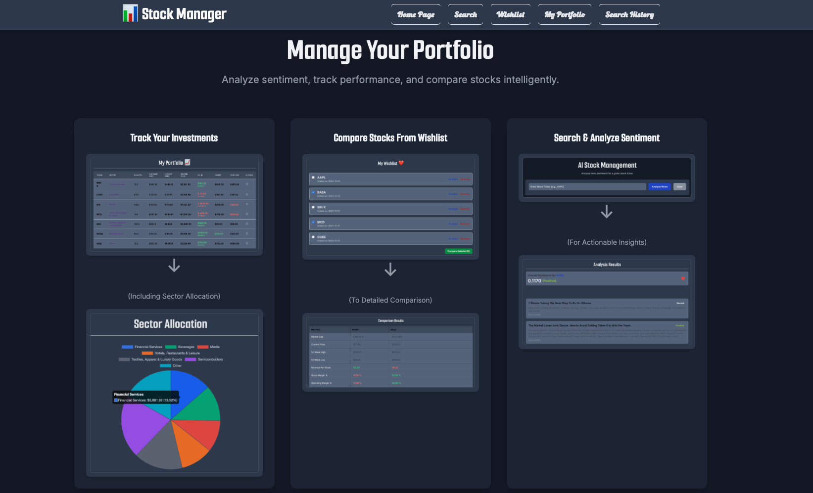

# AI Stock Manager 📊

A web application built with Flask and Python to analyze stock news sentiment, manage a personal portfolio, and compare stocks from a wishlist.

 

## Features ✨

* **Stock Sentiment Analysis:** Enter a stock ticker (e.g., AAPL) to fetch recent news and get an overall sentiment score (Positive/Negative/Neutral) based on headlines and summaries using TextBlob.
* **Wishlist:** Save interesting stocks to a wishlist and compare key financial metrics side-by-side (data fetched from Finnhub).
* **Portfolio Management:** Track your stock holdings (quantity, purchase price, etc.). Calculates current holding value and P/L based on real-time prices (fetched from Finnhub). Displays sector allocation via a pie chart (using Chart.js).
* **Search History:** Keeps a record of your recent stock analyses (paginated).
* **Dark Theme Interface:** Clean, modern user interface built with Tailwind CSS.

## Technologies Used 🛠️

* **Backend:** Python, Flask
* **Frontend:** HTML, Tailwind CSS (via CDN), JavaScript
* **Database:** SQLite
* **Sentiment Analysis:** TextBlob
* **Financial Data API:** Finnhub.io
* **Charting:** Chart.js

## Setup and Running 🚀

1.  **Clone the repository:**
    ```bash
    git clone [https://github.com/Saar1009/financial-sentiment-analyzer.git](https://github.com/Saar1009/financial-sentiment-analyzer.git)
    cd financial-sentiment-analyzer
    ```
2.  **(Recommended) Create a virtual environment:**
    ```bash
    python3 -m venv venv
    source venv/bin/activate  # On Windows use `venv\Scripts\activate`
    ```
3.  **Install dependencies:**
    ```bash
    pip install Flask requests textblob 
    # Make sure textblob is included
    ```
4.  **Run the application:**
    ```bash
    python app.py
    ```
5.  Open your browser and navigate to `http://127.0.0.1:5000`.

*(Note: The Finnhub API key is currently hardcoded in `app.py`. For production use, consider moving it to environment variables.)*

## Future Improvements 💡

* Implement user authentication.
* Add more detailed stock data (charts, historical prices).
* Allow editing portfolio entries.
* Implement removing items from the Wishlist comparison view.

*(Add or remove items as you see fit)*